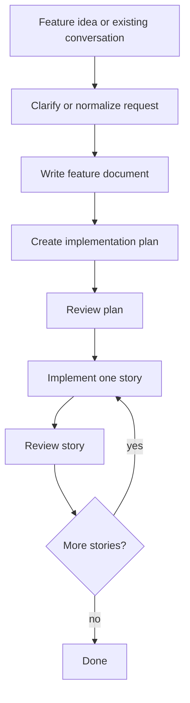

# TrailStep

TrailStep turns repeatable AI coding processes into typed, resumable workflows. It is designed for long-horizon coding tasks where each step can run in a focused agent session, receive only the context it needs, and hand structured output to the next step.

Instead of asking one long chat to clarify requirements, plan, implement, review, and recover from mistakes, TrailStep lets you encode that process as a workflow: durable handoffs between focused agent sessions.

## Quick start

Prerequisite: install a CLI coding agent that TrailStep can call. TrailStep has been tested most heavily with [Pi](https://github.com/earendil-works/pi-coding-agent) and Claude Code, so they currently have the best support. More provider support will continue to improve.

Install the TrailStep CLI, initialize project config, and install the TrailStep usage skill for your agent:

```bash
npm install --global @trailstep/cli
trailstep init --scope project --install-skill
```

Add the public reusable workflow package and generate project skills for the registered workflows:

```bash
trailstep add @trailstep/create-flows@latest --scope project --workflow "*" --project-skill --yes
```

After that, supported coding agents can discover and run the generated workflow skills. In agents that expose skills as slash commands, this lets you invoke workflows from the agent UI instead of manually typing CLI commands.

TrailStep can register workflows from:

- npm packages, such as `@trailstep/create-flows@latest`
- GitHub package specs, such as `github:acme/trailstep-workflows`
- local workflow files or bundles, such as `./workflows/review.ts#review`

<details>
<summary>Prefer direct CLI usage?</summary>

```bash
trailstep workflows
trailstep project/grill-it-away
trailstep project/take-it-away --input-file feature-request.json
```

</details>

## Scopes in one minute

TrailStep writes config at one of three scopes:

- **local**: private to this checkout/machine; good for personal overrides.
- **project**: shared project config; good for team workflow registrations and project skills.
- **global**: user-wide config; good for personal defaults and workflows you use everywhere.

Rule of thumb: use `--scope project` when setting up a repo for a team, `--scope local` for private project choices, and `--scope global` for personal cross-project defaults.

## A tiny workflow

A TrailStep workflow is a typed function that returns a step, another step, or a final result. Each step can dispatch to an agent, validate structured output, and decide what happens next.

Imagine a workflow that turns a rough feature request into a short summary and one recommended next step:

```text
feature request --> summarize-request step --> done({ summary, nextStep })
```

A real project should keep workflow entrypoints and step implementations separate as workflows grow:

```text
workflows/
  feature-summary.workflow.ts
  steps/
    summarize-request.step.ts
```

```ts
// workflows/feature-summary.workflow.ts
import { defineWorkflow, shape } from "@trailstep/authoring";
import { summarizeRequestStep } from "./steps/summarize-request.step.js";

type FeatureSummaryInput = { request: string };
type FeatureSummaryOutput = { summary: string; nextStep: string };

export const featureSummary = defineWorkflow<FeatureSummaryInput, FeatureSummaryOutput>({
  id: "feature-summary",
  description: "Summarize a feature request and suggest one next step.",
  inputShape: shape<FeatureSummaryInput>({ request: "string" }),
  outputShape: shape<FeatureSummaryOutput>({ summary: "string", nextStep: "string" }),
  start(input) {
    return summarizeRequestStep(input);
  },
});
```

```ts
// workflows/steps/summarize-request.step.ts
import { done, shape, step } from "@trailstep/authoring";

type FeatureSummaryInput = { request: string };
type FeatureSummaryOutput = { summary: string; nextStep: string };

export function summarizeRequestStep(input: FeatureSummaryInput) {
  return step({ id: "summarize-request" })
    .prompt<FeatureSummaryInput, FeatureSummaryOutput>(
      ({ input: stepInput }) =>
        `Summarize this feature request and recommend one next step:\n\n${stepInput.request}`,
      { output: shape<FeatureSummaryOutput>({ summary: "string", nextStep: "string" }) },
    )
    .do((output) => done(output))(input);
}
```

Run it directly while developing:

```bash
trailstep ./workflows/feature-summary.workflow.ts#featureSummary --input '{"request":"Add CSV export to reports."}'
```

Register it for your project and generate an agent skill:

```bash
trailstep add ./workflows/feature-summary.workflow.ts#featureSummary --scope project --name feature-summary --project-skill
```

## Why steps matter

TrailStep's step model is the core idea:

- **Focused context**: each step can run in its own agent session with a narrow prompt and purpose.
- **Typed handoffs**: steps pass validated JSON-object outputs to the next continuation.
- **Long-horizon work**: large jobs can be split into planning, implementation, review, and follow-up steps.
- **Retry and continuation**: failed or interrupted runs can continue through TrailStep instead of starting from scratch.
- **Agent-native use**: registered workflows can generate skills so agents understand when and how to call them.

## From tiny workflows to workflow systems

The same primitives power larger reusable workflow packages. `@trailstep/create-flows` currently publishes:

- **`grill-it-away`**: starts interactively, asks clarifying questions, then turns the result into an implementation workflow.
- **`take-it-away`**: starts from an existing conversation or feature request and runs the implementation workflow directly.

At a high level, those workflows expand the simple step pattern into a multi-stage coding process:



See [`packages/create-flows/README.md`](packages/create-flows/README.md) for the full behavior and usage details. These workflows are examples of what can be built on TrailStep; they are not the limit of the model.

## Packages

Public packages:

- [`@trailstep/cli`](packages/cli/README.md) — the `trailstep` command for init, agents, workflow registration, execution, retry, and updates.
- [`@trailstep/authoring`](packages/authoring/README.md) — TypeScript helpers for authoring workflows with `defineWorkflow`, `step`, and `done`.
- [`@trailstep/core`](packages/core/README.md) — framework-neutral runtime primitives, validation, events, retry state, providers, and run artifacts.
- [`@trailstep/create-flows`](packages/create-flows/README.md) — reusable general-purpose workflows, including `grill-it-away` and `take-it-away`.

Workspace packages not yet part of the initial public publish set:

- [`@trailstep/dashboard`](packages/dashboard/README.md) — local run observability UI.
- [`@trailstep/testkit`](packages/testkit/README.md) — workflow testing utilities while the public surface is finalized.

## Learn more

- [Getting started](docs/getting-started.md)
- [Authoring workflows](docs/authoring-workflows.md)
- [Generated skills](docs/generated-skills.md)
- [Scopes and config](docs/scopes-and-config.md)
- [CLI reference](docs/cli-reference.md)
- [Architecture](docs/architecture.md)
- [Reusable create flows](packages/create-flows/README.md)

## Contributing

This repository is a TypeScript-first pnpm monorepo and requires Node 24 or newer.

```bash
pnpm install
pnpm lint
pnpm typecheck
pnpm test
pnpm build
pnpm check:public-packages
pnpm run pack:public:dry-run
node scripts/check-local-artifact-ignore.mjs
```
