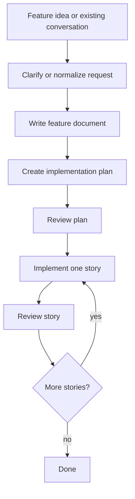

# TrailStep

**Durable, typed workflows for AI coding agents.**

TrailStep turns repeatable AI development work — clarify → plan → implement → review — into versioned TypeScript workflows that any CLI coding agent can run, resume, and hand off cleanly.

Built for long-horizon coding tasks where a single chat transcript breaks down.

> **Status:** TrailStep is early and under active iteration. Core workflows run end-to-end, but APIs, docs, and polish are still evolving — feedback and issues are welcome.

### The problem: one long chat doesn't scale

Single-session AI coding works for small edits, but fails on real features:

- **Context rot:** every stage re-reads an ever-growing transcript
- **Fragile handoffs:** plans and reviews passed as free text
- **No resume:** an interruption means starting over
- **No structure for repetition:** loops and parallel work are improvised each time

### What TrailStep does

Encode the process once as a workflow. TrailStep runs each stage as a focused agent session with only the context it needs, passing validated JSON between steps — looping over stories and fanning out parallel work when it helps:


```mermaid
flowchart TD
  A[Feature idea or existing conversation] --> B[Clarify or normalize request]
  B --> C[Write feature document]
  C --> D[Create implementation plan]
  D --> E[Review plan]
  E --> F[Implement one story]
  F --> G[Review story]
  G --> H{More stories?}
  H -->|yes| F
  H -->|no| I[Done]
```

### Why it matters

- **Durable:** runs persist to `.trailstep/runs/` — inspectable, resumable, and retryable with `trailstep retry` / `trailstep continue`.
- **Typed:** TypeScript-first authoring with `defineWorkflow`, `step`, and `done`; inputs and outputs are validated at every boundary.
- **Loops, not just chains:** implement → review → next story, with plan review and story routing built in.
- **Parallel when it helps:** fan out independent explore / implement / review delegates to isolated git worktrees, then continue the main flow (see [Parallel sub-agents](#parallel-sub-agents-in-one-minute)).
- **Provider-agnostic:** works with Pi, Claude Code, and pluggable providers — no lock-in.
- **Agent-native:** `trailstep add` publishes workflows as agent skills / slash commands so agents know when and how to run them.
- **Observable:** local run artifacts and a dashboard for every step, delegate, and review.

### Without TrailStep vs. with TrailStep

| Without TrailStep | With TrailStep |
| --- | --- |
| One growing transcript every stage must read | Each step runs in its own agent session with a narrow prompt and purpose |
| Free-text notes between stages | Typed, validated JSON handoffs between steps |
| Restart from scratch on failure | Failed or interrupted runs resume with `trailstep retry` / `trailstep continue` |
| Loops and parallel work improvised per chat | Loops and parallel delegates are part of the workflow |
| Agents driven from outside the system | Registered workflows generate skills so agents know when and how to call them |

> Example in this repo: `grill-it-away` interviews you until the request is clear, then `take-it-away` plans, slices stories, implements and reviews story-by-story (in loops, with parallel delegates where useful), and opens a PR — all resumable. See [From tiny workflows to workflow systems](#from-tiny-workflows-to-workflow-systems).

## Quick start

Prerequisite: install a CLI coding agent that TrailStep can call. TrailStep has been tested most heavily with [Pi](https://github.com/earendil-works/pi-coding-agent) and Claude Code, so they currently have the best support. More provider support will continue to improve.

Install the TrailStep CLI:

```bash
npm install --global @trailstep/cli
```

Then start the interactive terminal setup from your project root:

```bash
trailstep init
```

Choose **project** scope for team-shared config, pick the agent/provider you want TrailStep to use, and say yes when asked to install the TrailStep usage skill. You can then open that default agent as a standalone managed session:

```bash
trailstep
trailstep open
```

Add the public reusable workflow package through the same interactive TUI:

```bash
trailstep add @trailstep/create-flows@latest
```

Choose **project** scope, select the workflows you want (or **Select all**), and add project skills when prompted. After that, supported coding agents can discover and run the generated workflow skills. In agents that expose skills as slash commands, this lets you invoke workflows from the agent UI instead of manually typing CLI commands.

TrailStep can register workflows from:

- npm packages, such as `@trailstep/create-flows@latest`
- GitHub package specs, such as `github:acme/trailstep-workflows`
- local workflow files or bundles, such as `./workflows/review.ts#review`

Check what was registered and start the interactive feature flow:

```bash
trailstep workflows
trailstep project/grill-it-away
```

Standalone `trailstep open [agent-or-provider]` sessions write `.trailstep/sessions/<session-id>/` artifacts and are separate from workflow runs, which write `.trailstep/runs/<runName>/`.

<details>
<summary>Need a scriptable flag-based setup?</summary>

Use this version for CI, bootstrap scripts, or terminals where prompts are unavailable:

```bash
trailstep init --scope project --install-skill
trailstep add @trailstep/create-flows@latest --scope project --workflow "*" --project-skill --yes
trailstep workflows
trailstep project/grill-it-away
trailstep project/take-it-away --input-file feature-request.json
```

</details>

## Providers in one minute

TrailStep provider registration is package- or manifest-based rather than built into `@trailstep/core`.

```bash
trailstep providers add <path-or-package>
trailstep providers add @trailstep/provider-pi --scope project
trailstep providers add ./providers/my-agent.trailstep-provider.json --scope project
trailstep providers test pi --scope project
```

Package providers may include hooks that execute provider package code, so they should be trusted like installed npm dependencies. `trailstep providers test` is the safe inspection path when you want to verify provider wiring without running a full workflow.

## Scopes in one minute

TrailStep writes config at one of three scopes:

- **local**: private to this checkout/machine; good for personal overrides.
- **project**: shared project config; good for team workflow registrations and project skills.
- **global**: user-wide config; good for personal defaults and workflows you use everywhere.

Rule of thumb: use `--scope project` when setting up a repo for a team, `--scope local` for private project choices, and `--scope global` for personal cross-project defaults.

## A tiny workflow

A TrailStep workflow is a typed function that returns a step, another step, or a final result. Each step can dispatch to an agent with `.prompt(...)`, then decide what happens next with `.do(...)`.

Create one local workflow file:

```ts
// workflows/feature-summary.workflow.ts
import { defineWorkflow, done, shape, step } from "@trailstep/authoring";

type FeatureSummaryInput = {
  readonly request: string;
};

type FeatureSummaryOutput = {
  readonly summary: string;
};

const featureSummaryOutput = shape<FeatureSummaryOutput>({
  summary: "string",
});

export const summarizeRequestStep = step({ id: "summarize-request" })
  .prompt<FeatureSummaryInput, FeatureSummaryOutput>(
    ({ input }) => `Summarize this feature request:\n\n${input.request}`,
    { output: featureSummaryOutput },
  )
  .do((output) => {
    // This is normal TypeScript. Run code, write files, call APIs,
    // inspect the repo, or transform the agent's structured output here.
    //
    // Return done(...), fail(...), or another step.
    return done({ summary: output.summary });
  });

export const featureSummary = defineWorkflow<FeatureSummaryInput, FeatureSummaryOutput>({
  id: "feature-summary",
  description: "Summarize a feature request.",
  start(input) {
    return summarizeRequestStep(input);
  },
});
```

The `output` shape tells TrailStep what JSON object the agent must return. As workflows grow, move shared shapes, prompts, and steps into separate files.

Add the file to your project workflows and run it:

```bash
trailstep add ./workflows/feature-summary.workflow.ts
trailstep feature-summary --input '{"request":"Add CSV export to reports."}'
```

The add command prompts for scope, name, and skill generation. If you choose project scope, `trailstep feature-summary` resolves to the project workflow registration.

<details>
<summary>Scriptable local workflow setup</summary>

```bash
trailstep add ./workflows/feature-summary.workflow.ts --scope project --project-skill --yes
trailstep feature-summary --input '{"request":"Add CSV export to reports."}'
```

</details>

## How steps work

The bullets at the top are powered by one mechanism: continuations. A workflow starts with input, returns a step, receives structured output, then returns the next step or `done(...)`.

- `.prompt(...)` dispatches a focused prompt to an agent session with a declared JSON output shape.
- `.do(...)` is plain TypeScript — run code, inspect the repo, call APIs, then route to the next step, loop back, fan out delegates, or finish.
- `.display(...)` / `.wait(...)` add durable progress events and human-approval pauses where needed.

See [Authoring workflows](docs/authoring-workflows.md) and [Architecture](docs/architecture.md) for the full lifecycle.

## Parallel sub-agents in one minute

Fan out independent tasks — explore, implement, review — to focused delegates at once:

```json
{
  "context": "Shared repo context for every delegate.",
  "worktree": { "enabled": true, "baseRef": "main" },
  "tasks": [
    { "id": "map-parser", "mode": "explore", "task": "Map parser failure area" },
    { "id": "fix-parser", "mode": "implement", "task": "Fix path normalization" },
    { "id": "review-parser", "mode": "review", "task": "Review the parser fix" }
  ]
}
```

Save that as `delegate-parallel-input.json` and run it. Inside a checkout of this repository, use the workspace build of the CLI — note that `pnpm exec trailstep` resolves to the globally installed CLI, not the dev build:

```bash
node packages/cli/dist/index.js ./packages/sub-agents#delegateParallel --input-file delegate-parallel-input.json
```

With `@trailstep/sub-agents` registered, the published equivalent is:

```bash
trailstep project/delegateParallel --input-file delegate-parallel-input.json
```

- Each task runs in a managed git worktree at `.trailstep/worktrees/<runName>/<taskId>` (branch `trailstep/delegate/<runName>/<taskId>`), cleaned up automatically when it completes cleanly.
- `delegateParallel` returns the raw parallel branch outputs; merging and final aggregation are intentionally left to the parent agent.

See [`packages/sub-agents/README.md`](packages/sub-agents/README.md) for delegate modes and options.

## From tiny workflows to workflow systems

The same primitives power larger reusable workflow packages. `@trailstep/sub-agents` currently publishes delegate workflows for focused sub-agent work, and `@trailstep/create-flows` currently publishes:

- **`grill-it-away`**: starts interactively, asks clarifying questions, then turns the result into an implementation workflow.
- **`take-it-away`**: starts from an existing conversation or feature request and runs the implementation workflow directly.

These workflows are durable and retry-aware: sub-agent memory and story routing are recorded in `.trailstep/runs/<runName>/` so interrupted work can resume with `trailstep retry` or `trailstep continue` instead of restarting planning. The high-level shape is the clarify → plan → review → implement loop shown at the top of this README.

See [`packages/create-flows/README.md`](packages/create-flows/README.md) for the full behavior and usage details. These workflows are examples of what can be built on TrailStep; they are not the limit of the model.

## Packages

Public packages:

- [`@trailstep/cli`](packages/cli/README.md) — the `trailstep` command for init, agents, workflow registration, execution, retry, and updates.
- [`@trailstep/authoring`](packages/authoring/README.md) — TypeScript helpers for authoring workflows with `defineWorkflow`, `step`, and `done`.
- [`@trailstep/core`](packages/core/README.md) — framework-neutral runtime primitives, validation, events, retry state, providers, and run artifacts.
- [`@trailstep/create-flows`](packages/create-flows/README.md) — reusable general-purpose workflows, including `grill-it-away` and `take-it-away`.
- [`@trailstep/sub-agents`](packages/sub-agents/README.md) — reusable delegate workflows for focused sub-agent research, review, and implementation chunks.

Workspace packages not yet part of the initial public publish set:

- [`@trailstep/testkit`](packages/testkit/README.md) — workflow testing utilities while the public surface is finalized.

## Learn more

- [Getting started](docs/getting-started.md)
- [Authoring workflows](docs/authoring-workflows.md)
- [Generated skills](docs/generated-skills.md)
- [Scopes and config](docs/scopes-and-config.md)
- [CLI reference](docs/cli-reference.md)
- [Architecture](docs/architecture.md)
- [Reusable create flows](packages/create-flows/README.md)

## Contributing

This repository is a TypeScript-first pnpm monorepo and requires Node 24 or newer.

```bash
pnpm install
pnpm lint
pnpm typecheck
pnpm test
pnpm build
pnpm check:public-packages
pnpm run pack:public:dry-run
node scripts/check-local-artifact-ignore.mjs
```
