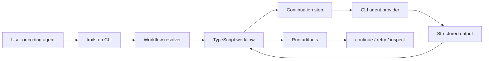
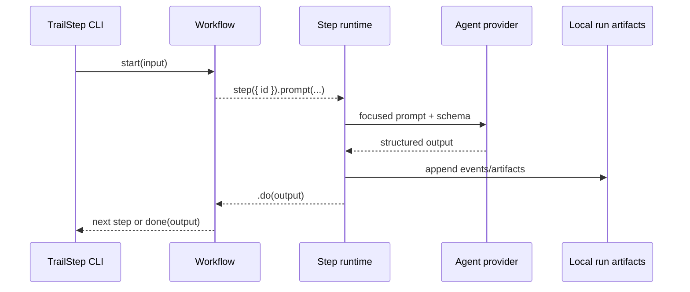

# TrailStep architecture

TrailStep is built around durable continuations: a workflow starts with input, returns a step, receives structured output, and returns the next continuation until it completes.

## Design goals

- Break long-horizon coding work into focused agent sessions.
- Give each step the context and prompt it needs, not an ever-growing chat transcript.
- Validate JSON-object inputs and outputs at workflow and step boundaries.
- Persist enough local state to inspect, continue, and retry runs.
- Keep workflow authoring TypeScript-first while leaving provider execution pluggable.

## Runtime flow

## Continuation lifecycle

Each step can be treated as a focused unit of work. Larger workflows compose those units into long-running processes such as clarify → plan → review → implement → review.

## Packages

- `@trailstep/core`: framework-neutral runtime primitives, validation, continuation execution, events, provider contracts, retry state, and run artifacts.
- `@trailstep/authoring`: TypeScript authoring helpers layered over core primitives.
- `@trailstep/cli`: workflow discovery, registration, config, provider targeting, execution, continuation, retry, and package lifecycle commands.
- `@trailstep/create-flows`: reusable workflow package demonstrating larger workflow architectures.

## Provider boundary

TrailStep dispatches prompt steps through provider targets. Provider configuration lives in TrailStep config and can select model/thinking overrides where supported.

The best-tested providers today are Pi and Claude Code. TrailStep also keeps provider contracts isolated so support can expand without changing workflow source.

## Persistence boundary

Run artifacts live under `.trailstep/runs` by default. They are generated outputs for inspection, continuation, and retry. Workflow source, package metadata, and config remain the source of truth; run artifacts should not be manually edited to recover state.

## Package-backed workflows

Package-backed registrations let teams publish workflows as npm/GitHub packages and install them into a selected TrailStep scope. The CLI discovers package workflow manifests, registers stable refs, and stores package metadata so remove/update commands can be conservative.

## Generated skills

Generated skills are an integration layer between TrailStep's registered workflow refs and coding-agent UX. A skill explains when and how an agent should run a workflow, write input files, continue interrupted work, or retry failed runs.
