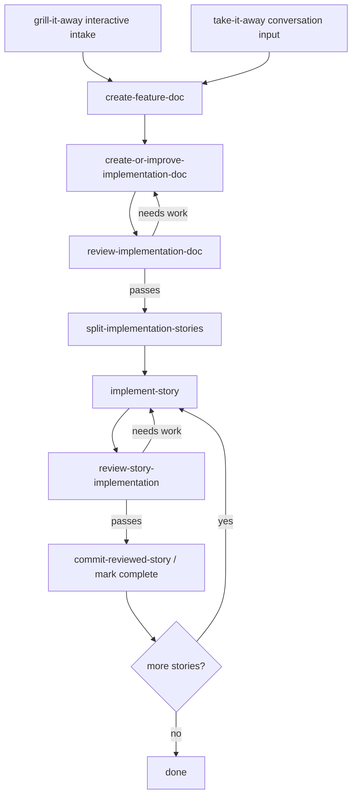

# @trailstep/create-flows

`@trailstep/create-flows` is a public package of reusable, general-purpose TrailStep workflows. It demonstrates how TrailStep's small step model can grow into larger, long-horizon coding workflows with focused agent sessions, typed handoffs, review loops, and retryable boundaries.

## Workflows

- `grillItAway`: default registered id `grill-it-away`; starts interactively by asking clarifying questions, then runs the implementation pipeline.
- `takeItAway`: default registered id `take-it-away`; starts from an already-organic conversation, ticket, or feature request, then runs the implementation pipeline.

Both workflows end with a typed output containing implementation status, feature/implementation document paths, completed story count, completed story titles, and a summary.

## Recommended setup

Install the TrailStep CLI if you do not already have it, then use the interactive setup from your project root:

```bash
npm install --global @trailstep/cli
trailstep init
trailstep add @trailstep/create-flows@latest
```

Choose **project** scope, install the TrailStep usage skill, select the workflows you want, and add project skills when prompted. Project skills let supported coding agents discover and run the workflows from the agent UI.

<details>
<summary>Scriptable setup</summary>

```bash
# Initialize config and install the packaged TrailStep usage skill.
trailstep init --scope project --install-skill

# Preview without installing, registering, or writing skills.
trailstep add @trailstep/create-flows@latest --scope project --workflow "*" --project-skill --dry-run

# Install/register both workflows and generate project skills.
trailstep add @trailstep/create-flows@latest --scope project --workflow "*" --project-skill --yes
```

</details>

Run registered workflows directly if you prefer the CLI:

```bash
trailstep project/grill-it-away
trailstep project/take-it-away --input-file feature-request.json
trailstep retry project/take-it-away <runName>
```

## Which workflow should I use?

### `grill-it-away`

Use this when you have an idea but not a complete feature request. The first step is interactive: the grilling agent asks questions until it can produce the normalized `take-it-away` input.

```text
rough idea --> interactive grill step --> { conversation } --> implementation pipeline
```

### `take-it-away`

Use this when you already have enough context in a conversation, ticket, issue, or feature request. It skips the interactive grill step and starts the implementation pipeline directly.

Input is a JSON object:

```json
{
  "conversation": "We need a workflow that exports widget reports..."
}
```

## Step architecture

The two workflows share the same implementation pipeline after initial intake:



The important TrailStep pattern is not the specific feature methodology; it is the architecture:

- each stage is a focused step with its own prompt and agent role
- each step passes structured output to the next step
- planning and implementation have review loops
- stories are split so implementation work happens one story at a time
- failed runs can be retried through TrailStep instead of restarting the entire conversation

## Agent roles

The workflows declare role defaults so TrailStep can target different kinds of agent work:

- **grillingAgent**: clarifies vague requests interactively.
- **featureWriter**: turns the request/conversation into a standalone feature document.
- **planner**: creates or improves an architecture-aware implementation plan.
- **reviewer**: reviews implementation docs and story diffs.
- **implementer**: implements one story at a time.

## Safety notes

These workflows are intended to change the current project when they reach implementation steps. Review your working tree before and after runs.

By default, the `commit-reviewed-story` step marks reviewed stories complete without creating commits. Automatic story commits are enabled only when `TRAILSTEP_STORY_COMMIT_MODE` is set to `1`, `true`, `enabled`, or `worktree`.

Generated run artifacts live under `.trailstep/runs` by default. Inspect them when needed, but do not edit them to recover workflow state; use `trailstep continue` or `trailstep retry`.

## Direct package install

If you want to import the workflows from TypeScript or run bundle refs directly after installing them yourself, install the package and its peer dependency:

```bash
npm install @trailstep/create-flows @trailstep/authoring
```

Then direct bundle refs use manifest names:

```bash
trailstep @trailstep/create-flows#takeItAway --input-file feature-request.json
trailstep @trailstep/create-flows#grillItAway
```

Use the equivalent install command for your package manager if you use `pnpm`, `yarn`, or `bun`.
